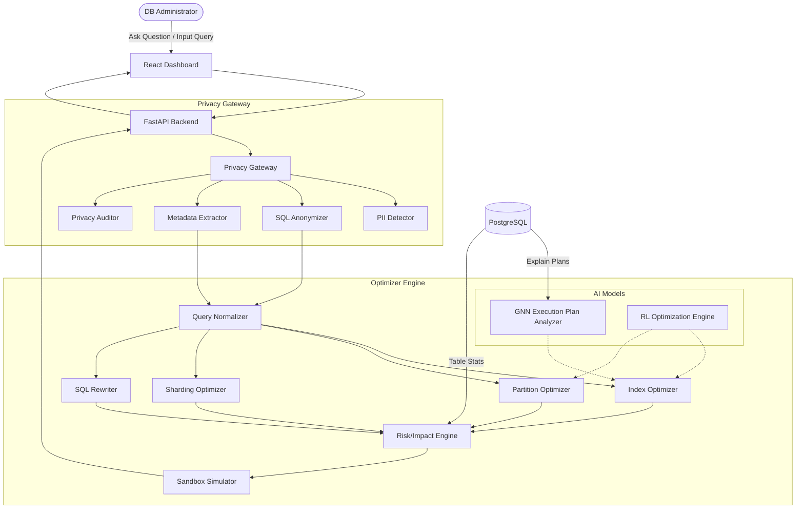

# PrivDB Optimizer — Privacy-Preserving AI Database Performance Optimizer

PrivDB Optimizer is an enterprise-grade database performance tuning dashboard that automates indexing, partitioning, sharding, and SQL rewriting while enforcing strict zero-data-exposure guardrails. 

Raw production data never reaches the AI layer. Instead, incoming data patterns are abstracted into anonymized structural metadata before being fed to the optimization engine (RL & GNN). Structural changes are simulated in a sandbox before receiving human approval, ensuring zero risk to live production environments.

## Architecture



## Features

- **Zero Data Exposure**: 100% of sensitive raw data is bitmasked or hashed prior to AI processing.
- **Simulation Accuracy**: Simulated impacts on write-latency and storage without applying changes to live tables.
- **Optimization Efficacy**: Analyzes queries to recommend composite indexes, partitioning, and SQL rewrites.
- **Explainability**: Optimization interventions include human-readable reasons and specific metadata evidence.
- **Robustness**: RL-inspired models and heuristic fallbacks adapt to evolving query patterns.

## Getting Started

### Prerequisites

- Node.js 18+ 
- Python 3.9+
- PostgreSQL (Optional, for running against a real database - the app includes a Demo Mode)

### Running the Backend

```bash
cd backend
python -m venv venv
# Windows: venv\Scripts\activate
# Unix/MacOS: source venv/bin/activate
pip install -r requirements.txt
python -m uvicorn app.main:app --host 0.0.0.0 --port 8000 --reload
```

The API will be available at `http://localhost:8000`.
Interactive API Documentation (Swagger UI) is available at `http://localhost:8000/docs`.

### Running the Frontend

```bash
cd frontend
npm install
npm run dev
```

The dashboard will be available at `http://localhost:5173`.

### Running Tests

```bash
python -m pytest tests/test_all.py -v
```

## Demo Instructions

1. **Open the Dashboard**: Navigate to `http://localhost:5173`.
2. **View Database Health**: Look at the Overview page to see simulated metrics.
3. **Query Analyzer**: Go to the Query Analyzer page.
   - You can enter a natural language question like: `"Why is the weekly sales reporting dashboard timing out?"`
   - Or paste a raw SQL query with sensitive data.
4. **View Privacy in Action**: Notice how the query is transformed into `TABLE_1`, `COL_1`, etc., and literals are masked before analysis.
5. **Review AI Recommendations**: The AI will suggest indexes or rewrites.
6. **Simulate**: Click "Simulate" on a recommendation to see the estimated Before vs. After metrics (execution time, storage cost, write latency).
7. **Approve**: Click "Approve" to generate safe migration and rollback SQL. Production is never modified directly.
8. **Privacy Audit**: Visit the Privacy Center to see that 0 raw records were exposed during the session.

## Example API Requests

### Analyze a Query
```bash
curl -X POST "http://localhost:8000/api/query/analyze" \
     -H "Content-Type: application/json" \
     -d '{
           "sql": "SELECT customer_name, email, revenue FROM customers WHERE region_id = 17 AND transaction_date > '\''2026-01-01'\''"
         }'
```

### Get Privacy Stats
```bash
curl -X GET "http://localhost:8000/api/privacy/stats"
```

### Ask the Assistant
```bash
curl -X POST "http://localhost:8000/api/assistant/ask" \
     -H "Content-Type: application/json" \
     -d '{
           "question": "Why is the weekly sales reporting dashboard timing out?"
         }'
```

## Guardrails Implemented

- Production database is READ-ONLY.
- No DDL/DML execution directly from the AI.
- No credentials or raw rows sent to AI.
- High-risk changes (partitioning, sharding) require explicit human approval.
- Every recommendation has a rollback plan.
